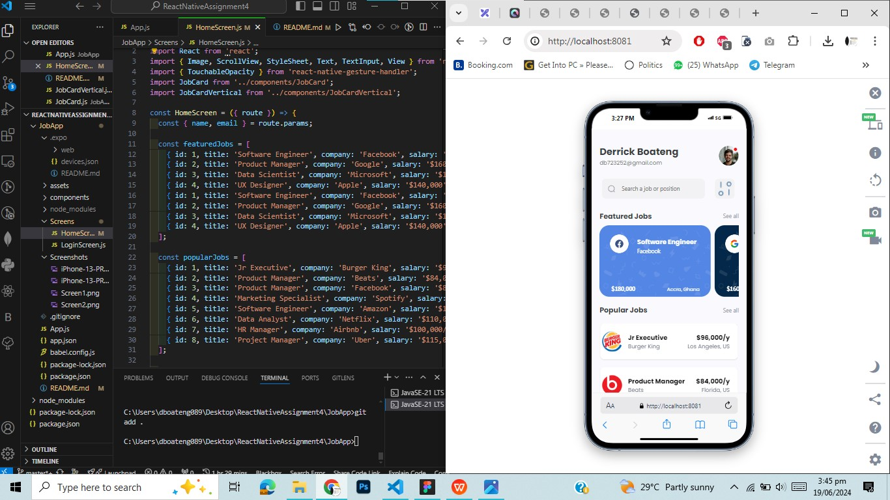
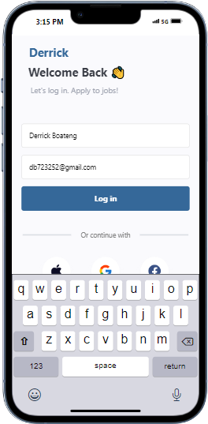

# React Native Job Listing App
This project is a React Native application that recreates the design in the provided UI mockup. The app includes a login screen that passes user details to the home screen and displays job cards in a structured format.

# Components
## Login Screen
This component handles the user login functionality.
The login screen takes user input for name and email. Upon pressing the login button, it navigates to the HomeScreen and passes the user details.

## Home Screen
The Home screen displays the user's name and email at the top.
The screen is divided into two sections: "Popular" and "Featured" job cards.

## Popular and Featured Job Cards
A functional component that accepts props for the card details.
This component displays at least 8 different job cards in each section.

# Screenshots of Project

.png>)

## Conclusion
The README file provides an overview of the application's structure and the usage of its key components.