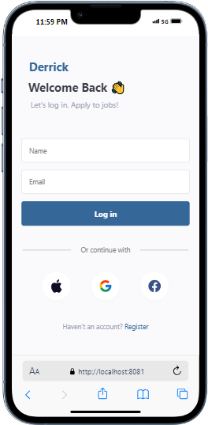
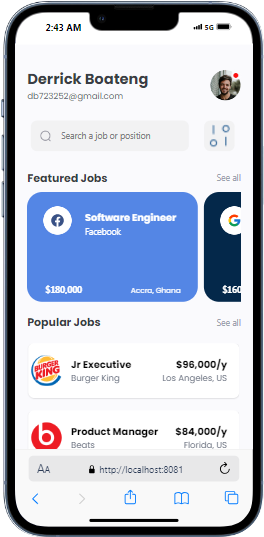
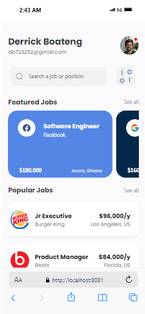

# React Native Job Listing App
This project is a React Native application that recreates the design in the provided UI mockup. The app includes a login screen that passes user details to the home screen and displays job cards in a structured format.

# Components
##LoginScreen
## Usage
This component handles the user login functionality.
The login screen takes user input for name and email. Upon pressing the login button, it navigates to the HomeScreen and passes the user details.

# Screenshots of Project

.png>)

